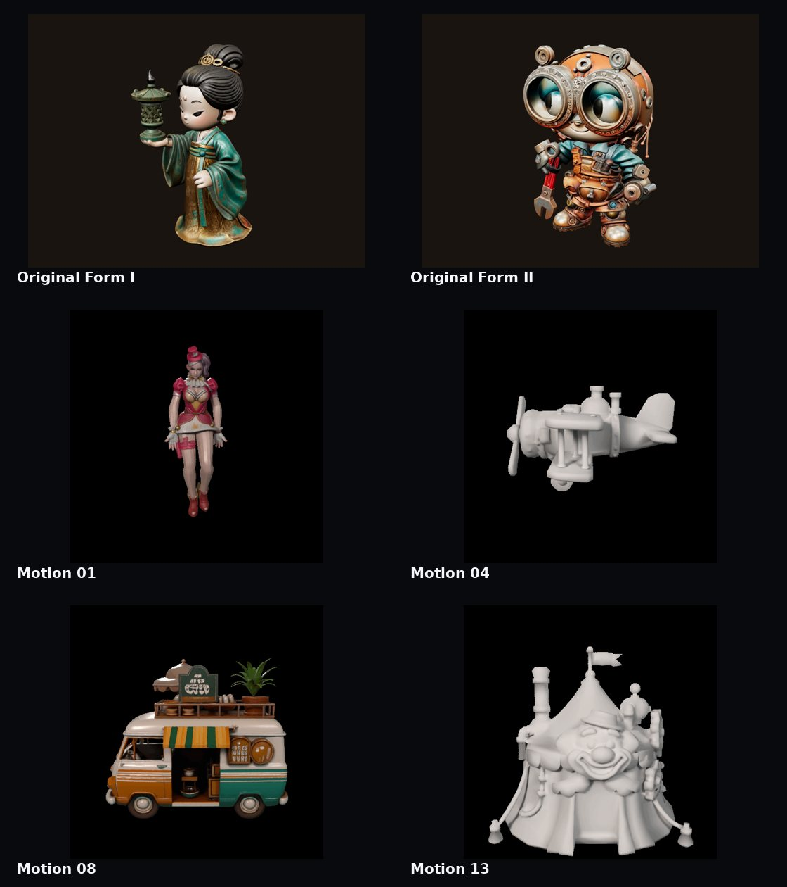

# ZIEOP — World-Class Pro

> A cinematic, static-first creative-tech portfolio for **3D · Motion · Web · Experiments**.

## Final build

This package is the final unified Zieop direction. The older versioned presentation (`v1` … `v7`) is not used in the active UI.

The experience is organized as a single premium page with:

- Featured work
- Original local 3D collection
- 3D World
- Open-source 3D gallery
- Art Wall
- 15-piece Motion Archive
- Zieop Lab / experiments
- Product-style system section
- Contact section

The project intentionally stays static-first: **no framework build step, no backend, and no required database**.

## Visual preview

The README includes a compact visual wall built only from assets already present in this package.

## What was audited

The final package was reviewed file-by-file and reference-by-reference for:

- HTML entry-point parity
- Navigation anchors
- Local asset references
- Generated motion filenames
- GLB/PNG/GIF inventory
- Section order and numbering
- Accessibility basics
- Open-model source labels
- License separation
- Hosting entry points
- Filename consistency
- Legacy/versioned naming
- README/package consistency

### Final fixes in this pass

- Fixed and verified the skip-to-content path.
- Added a direct `top` anchor on the hero.
- Normalized section order and numbering to **01 → 09**.
- Added direct navigation for **Art Wall** and **Motion**.
- Updated page metadata/title to the final **World-Class Pro** direction.
- Added proper `aria-label` text to local fullscreen controls.
- Added dialog semantics to the visual preview modal.
- Added an actual `.gitignore` so the package is repo-ready without renaming a template file.
- Added README visual assets (`zieop-readme-banner.jpg`, `zieop-readme-gallery.jpg`).
- Kept `index.html` and `zieop.html` byte-for-byte identical.
- Kept the supplied local GLB/GIF/PNG assets unchanged.

## Package map

| File | Purpose |
|---|---|
| `index.html` | Primary static-hosting entry point. |
| `zieop.html` | Matching standalone mirror of the final page. |
| `.gitignore` | Ready-to-use Git ignore rules. |
| `zieop-gitignore` | Compatibility copy of the same ignore rules. |
| `zieop-model-01.glb` | Supplied original 3D asset 01. |
| `zieop-model-01.png` | Poster/render for original model 01. |
| `zieop-model-02.glb` | Supplied original 3D asset 02. |
| `zieop-model-02.png` | Poster/render for original model 02. |
| `zieop-preview-01.gif` … `zieop-preview-15.gif` | Supplied 15-piece motion archive. |
| `zieop-readme-banner.jpg` | README hero visual made from supplied artwork. |
| `zieop-readme-gallery.jpg` | README contact sheet made from supplied artwork. |
| `zieop-readme.md` | Final project documentation. |
| `zieop-license.txt` | Code/license and third-party asset notice. |

## Content inventory

- **2** local GLB models
- **2** local model poster PNGs
- **15** local GIF motion studies
- **4** live Khronos glTF showcase models
- **1** Featured Works section
- **1** Original Collection section
- **1** 3D World section
- **1** Open Models section
- **1** Art Wall
- **1** Motion Archive
- **1** Zieop Lab
- **1** System section
- **1** Contact section

## Section map

| # | Section | Anchor |
|---:|---|---|
| 01 | Selected works | `#featured` |
| 02 | Local collection | `#collection` |
| 03 | 3D World | `#world` |
| 04 | Open-source gallery | `#open` |
| 05 | Art Wall | `#art` |
| 06 | Motion Archive | `#motion` |
| 07 | Zieop Lab | `#lab` |
| 08 | System | `#system` |
| 09 | Contact | `#contact` |

## Open-source 3D showcase

The active page showcases four models from the Khronos glTF Sample Assets repository:

1. **Boom Box**
2. **Corset**
3. **Iridescence Suzanne**
4. **Diffuse Transmission Teacup**

The Khronos catalog currently lists the selected showcase assets **Boom Box, Corset, Iridescence Suzanne, and Diffuse Transmission Teacup** as CC0. The repository is a curated collection of glTF assets used to demonstrate format features and capabilities; each asset can have its own license, so the page keeps license labels tied to the individual asset rather than treating the entire repository as one license.

Source: https://github.com/KhronosGroup/glTF-Sample-Assets/blob/main/Models/Models.md

The page also links to **Poly Haven** as an additional open-asset source. Poly Haven states that its HDRIs, textures, and 3D models are released under CC0.

Source: https://polyhaven.com/license

## Runtime dependencies

The interactive 3D viewer is loaded from Google-hosted `model-viewer`:

`https://ajax.googleapis.com/ajax/libs/model-viewer/4.0.0/model-viewer.min.js`

The four showcase GLB files are loaded from jsDelivr URLs pointing to the Khronos sample-asset repository.

That means the **interactive open-model showcase depends on an internet connection**. The supplied Zieop GLB, PNG, GIF, and README images remain local to this package.

## Hosting

### Vercel

1. Deploy the `zieop` folder.
2. Keep `index.html` at the deployment root.
3. No build command is required.
4. No framework adapter is required.

### Other static hosts

Any normal static host that can serve HTML, CSS, JavaScript, PNG/JPG/GIF, and GLB files can serve the package.

## Interaction map

- `Featured` → selected work presentation
- `3D World` → atmospheric visual world
- `Open Models` → live open-source 3D gallery
- `Art Wall` → visual preview wall
- `Motion` → searchable 15-item motion archive
- `Lab` → experimental direction
- `Contact` → collaboration CTA
- `/` → focuses the motion search field
- Local model fullscreen controls → available on the original model cards
- Motion and Art Wall cards → open in the visual preview modal

## Asset / license notes

The supplied local files (`zieop-model-*`, `zieop-preview-*`, and supplied renders) are treated as source-project assets. This package does **not** assume ownership or automatically relicense those files.

The project/code license is documented separately. Third-party open-source model licenses remain governed by their upstream repositories.

The README preview images were generated from supplied project artwork for documentation/preview purposes.

### Contact placeholder

The page currently uses `hello@zieop.com` as the contact CTA address. Replace that address with the real portfolio email before publishing if `hello@zieop.com` is not your intended inbox.

## Design direction

The final visual language is intentionally:

- Dark
- Minimal
- Cinematic
- 3D-first
- Editorial rather than crowded
- Responsive
- Reduced-motion aware
- Static-host friendly
- Built around one final unified identity rather than versioned UI screens

## Final QA checklist

- [x] `index.html` exists
- [x] `zieop.html` matches `index.html`
- [x] 2 local GLBs present
- [x] 2 local model PNGs present
- [x] 15 motion GIFs present
- [x] Motion script generates the exact `01`–`15` filenames
- [x] Main section anchors exist
- [x] Navigation links resolve to existing sections
- [x] Skip link resolves to `#content`
- [x] Local fullscreen controls have accessible labels
- [x] Modal has dialog semantics
- [x] `.gitignore` is ready to use
- [x] README visual assets are packaged
- [x] No active `v1`–`v7` UI naming is used
- [x] Third-party licenses are kept separate from project-code licensing

## Upstream references

- Khronos glTF Sample Assets: https://github.com/KhronosGroup/glTF-Sample-Assets
- Khronos model catalog: https://github.com/KhronosGroup/glTF-Sample-Assets/blob/main/Models/Models.md
- Poly Haven Models: https://polyhaven.com/models
- Poly Haven License: https://polyhaven.com/license

## Model Vault

The UI now serves the two bundled Zieop models locally. The Khronos catalog is documented separately because its assets use different licenses; Zieop will only mirror each model with its matching license and attribution. See `MODEL-VAULT.md`.

## Repository migration

See `REPO-MIGRATION.md` for the GitHub/Vercel cutover checklist.
