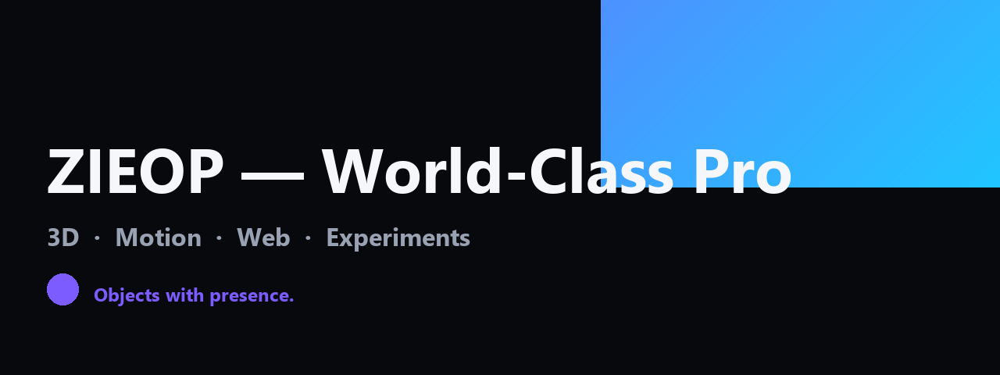
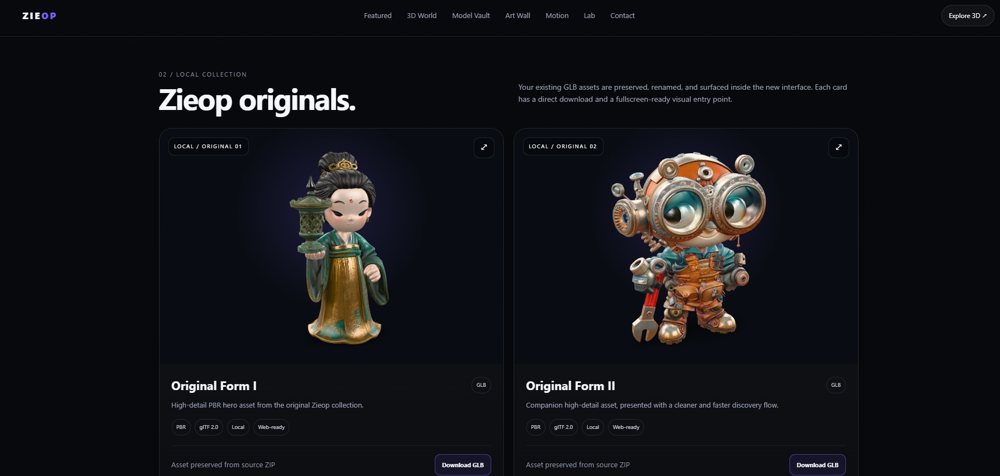

<div align="center">

# ZIEOP — World-Class Pro

### A cinematic, static-first creative-tech portfolio for **3D · Motion · Web · Experiments**



</div>

---

## ✦ What is Zieop?

A premium, dark, cinematic portfolio for **3D objects, motion studies, interactive web experiments, and open-source model showcases** — built entirely as static HTML with no framework, no backend, and no required database.

> Objects with presence.

The site delivers a single unified `index.html` (with a byte-identical `zieop.html` mirror) that hosts:

- **2** local GLB models (Original Form I + II)
- **15** local GIF motion studies
- **4** live Khronos open-source showcase models (Boom Box · Corset · Iridescence Suzanne · Diffuse Transmission Teacup)
- **9** numbered sections (01 → 09) covering Featured · Local Collection · 3D World · Model Vault · Art Wall · Motion · Lab · System · Contact



The screenshot above shows the **02 / LOCAL COLLECTION** section with Original Form I and Original Form II, each with `PBR · glTF 2.0 · Local · Web-ready` badges and a `Download GLB` action.

---

## 🎨 Design language

| Token | Value | Use |
|---|---|---|
| `--bg` | `#07090d` | Page background (deep cinematic dark) |
| `--panel` | `#0d1118` | Card surfaces |
| `--panel2` | `#111722` | Elevated surfaces |
| `--text` | `#f5f7fb` | Primary text |
| `--muted` | `#98a2b3` | Secondary text |
| `--accent` | `#7c5cff` | Primary violet accent |
| `--accent2` | `#12d7ff` | Secondary cyan accent |
| `--good` | `#57e389` | Success states |

**Font:** Inter / system stack — calm, editorial, screen-first.

**Visual direction:** Dark · Minimal · Cinematic · 3D-first · Editorial rather than crowded · Reduced-motion aware · Static-host friendly · Built around one final unified identity rather than versioned UI screens.

---

## 📦 Package inventory

| Asset | Count | Purpose |
|---|---:|---|
| Local GLB models | 2 | Hero objects for Featured + Local Collection |
| Local model PNGs | 2 | Poster renders (Original Form I + II) |
| Local GIF motion archive | 15 | Loop studies / render previews |
| Khronos showcase models | 4 | Live open-source GLBs via jsDelivr |
| MP4 world reels | 4 | `media/world/*.mp4` — environment · creature · vehicle · hero |
| World JPG stills | 4 | `media/world/*.jpg` — creature · dragon · architecture · gallery |
| Live sections | 9 | Numbered `01 → 09` navigation |
| README banner | 1 | `zieop-readme-banner.jpg` |
| Gallery contact sheet | 1 | `zieop-readme-gallery.jpg` |
| Site preview | 1 | `zieop-originals-preview.png` |

---

## 🧭 Section map (01 → 09)

| # | Section | Anchor |
|---:|---|---|
| 01 | Selected Works | `#featured` |
| 02 | Local Collection | `#collection` |
| 03 | 3D World | `#world` |
| 04 | Open-source Gallery (Model Vault) | `#open` |
| 05 | Art Wall | `#art` |
| 06 | Motion Archive | `#motion` |
| 07 | Zieop Lab | `#lab` |
| 08 | System | `#system` |
| 09 | Contact | `#contact` |

**Stats strip:** 02 ORIGINAL 3D ASSETS · 04 OPEN MODEL PICKS · 15 MOTION STUDIES · 09 CORE SECTIONS.

---

## 🔌 Open-source 3D showcase (Khronos)

The active page showcases **four models** from the [Khronos glTF Sample Assets](https://github.com/KhronosGroup/glTF-Sample-Assets/blob/main/Models/Models.md) repository — a curated catalog of **148 models** in total, all CC0 or CC-BY licensed.

The four showcased in Zieop:

| Model | License | Path on Khronos |
|---|---|---|
| **Boom Box** | CC0 | [BoomBox](https://github.com/KhronosGroup/glTF-Sample-Assets/tree/main/Models/BoomBox) |
| **Corset** | CC0 | [Corset](https://github.com/KhronosGroup/glTF-Sample-Assets/tree/main/Models/Corset) |
| **Iridescence Suzanne** | CC-BY 4.0 | [IridescenceSuzanne](https://github.com/KhronosGroup/glTF-Sample-Assets/tree/main/Models/IridescenceSuzanne) |
| **Diffuse Transmission Teacup** | CC0 | [DiffuseTransmissionTeacup](https://github.com/KhronosGroup/glTF-Sample-Assets/tree/main/Models/DiffuseTransmissionTeacup) |

The Khronos catalog documents each asset's individual license rather than treating the whole catalog as one license. Zieop follows the same pattern — see [`MODEL-VAULT.md`](./MODEL-VAULT.md) for the policy.

### Full Khronos glTF Sample Assets catalog (148 models)

Sourced from [`KhronosGroup/glTF-Sample-Assets/Models/Models.md`](https://github.com/KhronosGroup/glTF-Sample-Assets/blob/main/Models/Models.md) — every model in the catalog, grouped alphabetically with direct links.

**Source URL:** https://github.com/KhronosGroup/glTF-Sample-Assets/blob/main/Models/Models.md  
**Total models:** 148  
**Total unique URLs in catalog:** 274 (148 sample-viewer links + 118 raw GLB downloads + 5 Creative Commons license pages + 2 Sketchfab links + 1 GitHub link)

#### A

- [`A Beautiful Game`](https://github.com/KhronosGroup/glTF-Sample-Assets/tree/main/Models/ABeautifulGame)
- [`Alpha Blend Mode Test`](https://github.com/KhronosGroup/glTF-Sample-Assets/tree/main/Models/AlphaBlendModeTest)
- [`Animated Colors Cube`](https://github.com/KhronosGroup/glTF-Sample-Assets/tree/main/Models/AnimatedColorsCube)
- [`Animated Cube`](https://github.com/KhronosGroup/glTF-Sample-Assets/tree/main/Models/AnimatedCube)
- [`Animated Morph Cube`](https://github.com/KhronosGroup/glTF-Sample-Assets/tree/main/Models/AnimatedMorphCube)
- [`Animated Triangle`](https://github.com/KhronosGroup/glTF-Sample-Assets/tree/main/Models/AnimatedTriangle)
- [`AnimationPointerUVs`](https://github.com/KhronosGroup/glTF-Sample-Assets/tree/main/Models/AnimationPointerUVs)
- [`Anisotropy Barn Lamp`](https://github.com/KhronosGroup/glTF-Sample-Assets/tree/main/Models/AnisotropyBarnLamp)
- [`Anisotropy Disc Test`](https://github.com/KhronosGroup/glTF-Sample-Assets/tree/main/Models/AnisotropyDiscTest)
- [`Anisotropy Rotation Test`](https://github.com/KhronosGroup/glTF-Sample-Assets/tree/main/Models/AnisotropyRotationTest)
- [`Anisotropy Strength Test`](https://github.com/KhronosGroup/glTF-Sample-Assets/tree/main/Models/AnisotropyStrengthTest)
- [`Antique Camera`](https://github.com/KhronosGroup/glTF-Sample-Assets/tree/main/Models/AntiqueCamera)
- [`Attenuation Test`](https://github.com/KhronosGroup/glTF-Sample-Assets/tree/main/Models/AttenuationTest)
- [`Avocado`](https://github.com/KhronosGroup/glTF-Sample-Assets/tree/main/Models/Avocado)

#### B

- [`Barramundi Fish`](https://github.com/KhronosGroup/glTF-Sample-Assets/tree/main/Models/BarramundiFish)
- [`Boom Box`](https://github.com/KhronosGroup/glTF-Sample-Assets/tree/main/Models/BoomBox)
- [`Boom Box with Axes`](https://github.com/KhronosGroup/glTF-Sample-Assets/tree/main/Models/BoomBoxWithAxes)
- [`Box`](https://github.com/KhronosGroup/glTF-Sample-Assets/tree/main/Models/Box)
- [`Box With Spaces`](https://github.com/KhronosGroup/glTF-Sample-Assets/tree/main/Models/Box%20With%20Spaces)
- [`Box Animated`](https://github.com/KhronosGroup/glTF-Sample-Assets/tree/main/Models/BoxAnimated)
- [`Box with interleaved position and normal attributes`](https://github.com/KhronosGroup/glTF-Sample-Assets/tree/main/Models/BoxInterleaved)
- [`Box Textured`](https://github.com/KhronosGroup/glTF-Sample-Assets/tree/main/Models/BoxTextured)
- [`Box Textured not 2^N`](https://github.com/KhronosGroup/glTF-Sample-Assets/tree/main/Models/BoxTexturedNonPowerOfTwo)
- [`Box Vertex Colors`](https://github.com/KhronosGroup/glTF-Sample-Assets/tree/main/Models/BoxVertexColors)
- [`BrainStem`](https://github.com/KhronosGroup/glTF-Sample-Assets/tree/main/Models/BrainStem)

#### C

- [`Cameras`](https://github.com/KhronosGroup/glTF-Sample-Assets/tree/main/Models/Cameras)
- [`Car Concept`](https://github.com/KhronosGroup/glTF-Sample-Assets/tree/main/Models/CarConcept)
- [`Carbon Fibre Ball`](https://github.com/KhronosGroup/glTF-Sample-Assets/tree/main/Models/CarbonFibre)
- [`Cesium Man`](https://github.com/KhronosGroup/glTF-Sample-Assets/tree/main/Models/CesiumMan)
- [`Cesium Milk Truck`](https://github.com/KhronosGroup/glTF-Sample-Assets/tree/main/Models/CesiumMilkTruck)
- [`Chair Damask Purplegold`](https://github.com/KhronosGroup/glTF-Sample-Assets/tree/main/Models/ChairDamaskPurplegold)
- [`Chronograph Watch`](https://github.com/KhronosGroup/glTF-Sample-Assets/tree/main/Models/ChronographWatch)
- [`Clear Coat Car Paint`](https://github.com/KhronosGroup/glTF-Sample-Assets/tree/main/Models/ClearCoatCarPaint)
- [`Clearcoat Wicker`](https://github.com/KhronosGroup/glTF-Sample-Assets/tree/main/Models/ClearcoatWicker)
- [`Commercial Refrigerator`](https://github.com/KhronosGroup/glTF-Sample-Assets/tree/main/Models/CommercialRefrigerator)
- [`Compare Alpha Coverage`](https://github.com/KhronosGroup/glTF-Sample-Assets/tree/main/Models/CompareAlphaCoverage)
- [`Compare Ambient Occlusion`](https://github.com/KhronosGroup/glTF-Sample-Assets/tree/main/Models/CompareAmbientOcclusion)
- [`Compare Anisotropy`](https://github.com/KhronosGroup/glTF-Sample-Assets/tree/main/Models/CompareAnisotropy)
- [`Compare Base Color`](https://github.com/KhronosGroup/glTF-Sample-Assets/tree/main/Models/CompareBaseColor)
- [`Compare Clearcoat`](https://github.com/KhronosGroup/glTF-Sample-Assets/tree/main/Models/CompareClearcoat)
- [`Compare Dispersion`](https://github.com/KhronosGroup/glTF-Sample-Assets/tree/main/Models/CompareDispersion)
- [`Compare Emissive Strength`](https://github.com/KhronosGroup/glTF-Sample-Assets/tree/main/Models/CompareEmissiveStrength)
- [`Compare IOR`](https://github.com/KhronosGroup/glTF-Sample-Assets/tree/main/Models/CompareIor)
- [`Compare Iridescence`](https://github.com/KhronosGroup/glTF-Sample-Assets/tree/main/Models/CompareIridescence)
- [`Compare Metallic`](https://github.com/KhronosGroup/glTF-Sample-Assets/tree/main/Models/CompareMetallic)
- [`Compare Normal`](https://github.com/KhronosGroup/glTF-Sample-Assets/tree/main/Models/CompareNormal)
- [`Compare Roughness`](https://github.com/KhronosGroup/glTF-Sample-Assets/tree/main/Models/CompareRoughness)
- [`Compare Sheen`](https://github.com/KhronosGroup/glTF-Sample-Assets/tree/main/Models/CompareSheen)
- [`Compare Specular`](https://github.com/KhronosGroup/glTF-Sample-Assets/tree/main/Models/CompareSpecular)
- [`Compare Transmission`](https://github.com/KhronosGroup/glTF-Sample-Assets/tree/main/Models/CompareTransmission)
- [`Compare Volume`](https://github.com/KhronosGroup/glTF-Sample-Assets/tree/main/Models/CompareVolume)
- [`Corset`](https://github.com/KhronosGroup/glTF-Sample-Assets/tree/main/Models/Corset)
- [`Cube`](https://github.com/KhronosGroup/glTF-Sample-Assets/tree/main/Models/Cube)
- [`CubeVisibility`](https://github.com/KhronosGroup/glTF-Sample-Assets/tree/main/Models/CubeVisibility)

#### D

- [`Damaged Helmet`](https://github.com/KhronosGroup/glTF-Sample-Assets/tree/main/Models/DamagedHelmet)
- [`Diffuse Transmission Plant`](https://github.com/KhronosGroup/glTF-Sample-Assets/tree/main/Models/DiffuseTransmissionPlant)
- [`Diffuse Transmission Teacup`](https://github.com/KhronosGroup/glTF-Sample-Assets/tree/main/Models/DiffuseTransmissionTeacup)
- [`DiffuseTransmissionTest`](https://github.com/KhronosGroup/glTF-Sample-Assets/tree/main/Models/DiffuseTransmissionTest)
- [`Directional Light`](https://github.com/KhronosGroup/glTF-Sample-Assets/tree/main/Models/DirectionalLight)
- [`Dispersion Test`](https://github.com/KhronosGroup/glTF-Sample-Assets/tree/main/Models/DispersionTest)
- [`Dragon Attenuation`](https://github.com/KhronosGroup/glTF-Sample-Assets/tree/main/Models/DragonAttenuation)
- [`Dragon Dispersion`](https://github.com/KhronosGroup/glTF-Sample-Assets/tree/main/Models/DragonDispersion)
- [`Duck`](https://github.com/KhronosGroup/glTF-Sample-Assets/tree/main/Models/Duck)

#### E

- [`Emissive Strength Test`](https://github.com/KhronosGroup/glTF-Sample-Assets/tree/main/Models/EmissiveStrengthTest)
- [`Environment Test`](https://github.com/KhronosGroup/glTF-Sample-Assets/tree/main/Models/EnvironmentTest)

#### F

- [`Flight Helmet`](https://github.com/KhronosGroup/glTF-Sample-Assets/tree/main/Models/FlightHelmet)
- [`Fox`](https://github.com/KhronosGroup/glTF-Sample-Assets/tree/main/Models/Fox)

#### G

- [`GlamVelvetSofa`](https://github.com/KhronosGroup/glTF-Sample-Assets/tree/main/Models/GlamVelvetSofa)
- [`Glass Broken Window`](https://github.com/KhronosGroup/glTF-Sample-Assets/tree/main/Models/GlassBrokenWindow)
- [`Glass Hurricane Candle Holder`](https://github.com/KhronosGroup/glTF-Sample-Assets/tree/main/Models/GlassHurricaneCandleHolder)
- [`Glass Vase with Flowers`](https://github.com/KhronosGroup/glTF-Sample-Assets/tree/main/Models/GlassVaseFlowers)

#### I

- [`IORTestGrid`](https://github.com/KhronosGroup/glTF-Sample-Assets/tree/main/Models/IORTestGrid)
- [`Interpolation Test`](https://github.com/KhronosGroup/glTF-Sample-Assets/tree/main/Models/InterpolationTest)
- [`IridescenceAbalone`](https://github.com/KhronosGroup/glTF-Sample-Assets/tree/main/Models/IridescenceAbalone)
- [`Iridescence Dielectric Spheres`](https://github.com/KhronosGroup/glTF-Sample-Assets/tree/main/Models/IridescenceDielectricSpheres)
- [`Iridescence Lamp`](https://github.com/KhronosGroup/glTF-Sample-Assets/tree/main/Models/IridescenceLamp)
- [`Iridescence Metallic Spheres`](https://github.com/KhronosGroup/glTF-Sample-Assets/tree/main/Models/IridescenceMetallicSpheres)
- [`Iridescence Suzanne`](https://github.com/KhronosGroup/glTF-Sample-Assets/tree/main/Models/IridescenceSuzanne)
- [`Iridescent Dish with Olives`](https://github.com/KhronosGroup/glTF-Sample-Assets/tree/main/Models/IridescentDishWithOlives)

#### K

- [`KHR_materials_clearcoat Test`](https://github.com/KhronosGroup/glTF-Sample-Assets/tree/main/Models/ClearCoatTest)

#### L

- [`Lantern`](https://github.com/KhronosGroup/glTF-Sample-Assets/tree/main/Models/Lantern)
- [`LightVisibility`](https://github.com/KhronosGroup/glTF-Sample-Assets/tree/main/Models/LightVisibility)
- [`Lamp with Punctual Lights`](https://github.com/KhronosGroup/glTF-Sample-Assets/tree/main/Models/LightsPunctualLamp)

#### M

- [`MandarinOrange`](https://github.com/KhronosGroup/glTF-Sample-Assets/tree/main/Models/MandarinOrange)
- [`Materials Variants Shoe`](https://github.com/KhronosGroup/glTF-Sample-Assets/tree/main/Models/MaterialsVariantsShoe)
- [`Mesh Primitive Modes`](https://github.com/KhronosGroup/glTF-Sample-Assets/tree/main/Models/MeshPrimitiveModes)
- [`Meshopt Cube Test`](https://github.com/KhronosGroup/glTF-Sample-Assets/tree/main/Models/MeshoptCubeTest)
- [`Metal-Rough Spheres`](https://github.com/KhronosGroup/glTF-Sample-Assets/tree/main/Models/MetalRoughSpheres)
- [`Metal-Rough Spheres (textureless)`](https://github.com/KhronosGroup/glTF-Sample-Assets/tree/main/Models/MetalRoughSpheresNoTextures)
- [`Morph-Primitives Test`](https://github.com/KhronosGroup/glTF-Sample-Assets/tree/main/Models/MorphPrimitivesTest)
- [`Morph Stress Test`](https://github.com/KhronosGroup/glTF-Sample-Assets/tree/main/Models/MorphStressTest)
- [`Mosquito In Amber`](https://github.com/KhronosGroup/glTF-Sample-Assets/tree/main/Models/MosquitoInAmber)
- [`MultiUV Test`](https://github.com/KhronosGroup/glTF-Sample-Assets/tree/main/Models/MultiUVTest)
- [`Multiple Scenes`](https://github.com/KhronosGroup/glTF-Sample-Assets/tree/main/Models/MultipleScenes)

#### N

- [`Negative Scale Test`](https://github.com/KhronosGroup/glTF-Sample-Assets/tree/main/Models/NegativeScaleTest)
- [`NodePerformanceTest`](https://github.com/KhronosGroup/glTF-Sample-Assets/tree/main/Models/NodePerformanceTest)
- [`Normal-Tangent Mirror Test`](https://github.com/KhronosGroup/glTF-Sample-Assets/tree/main/Models/NormalTangentMirrorTest)
- [`Normal-Tangent Test`](https://github.com/KhronosGroup/glTF-Sample-Assets/tree/main/Models/NormalTangentTest)

#### O

- [`Orientation Test`](https://github.com/KhronosGroup/glTF-Sample-Assets/tree/main/Models/OrientationTest)

#### P

- [`PlaysetLightTest`](https://github.com/KhronosGroup/glTF-Sample-Assets/tree/main/Models/PlaysetLightTest)
- [`Point Light Intensity Test`](https://github.com/KhronosGroup/glTF-Sample-Assets/tree/main/Models/PointLightIntensityTest)
- [`PotOfCoals`](https://github.com/KhronosGroup/glTF-Sample-Assets/tree/main/Models/PotOfCoals)
- [`Pot of Coals Animation Pointer`](https://github.com/KhronosGroup/glTF-Sample-Assets/tree/main/Models/PotOfCoalsAnimationPointer)
- [`Primitive Mode Normals Test`](https://github.com/KhronosGroup/glTF-Sample-Assets/tree/main/Models/PrimitiveModeNormalsTest)

#### R

- [`Recursive Skeletons`](https://github.com/KhronosGroup/glTF-Sample-Assets/tree/main/Models/RecursiveSkeletons)
- [`Rigged Figure`](https://github.com/KhronosGroup/glTF-Sample-Assets/tree/main/Models/RiggedFigure)
- [`Rigged Simple`](https://github.com/KhronosGroup/glTF-Sample-Assets/tree/main/Models/RiggedSimple)

#### S

- [`Skull`](https://github.com/KhronosGroup/glTF-Sample-Assets/tree/main/Models/ScatteringSkull)
- [`SciFi Helmet`](https://github.com/KhronosGroup/glTF-Sample-Assets/tree/main/Models/SciFiHelmet)
- [`Sheen Chair`](https://github.com/KhronosGroup/glTF-Sample-Assets/tree/main/Models/SheenChair)
- [`Sheen Cloth`](https://github.com/KhronosGroup/glTF-Sample-Assets/tree/main/Models/SheenCloth)
- [`SheenTestGrid`](https://github.com/KhronosGroup/glTF-Sample-Assets/tree/main/Models/SheenTestGrid)
- [`Sheen Wood Leather Sofa`](https://github.com/KhronosGroup/glTF-Sample-Assets/tree/main/Models/SheenWoodLeatherSofa)
- [`Simple Instancing`](https://github.com/KhronosGroup/glTF-Sample-Assets/tree/main/Models/SimpleInstancing)
- [`Simple Material`](https://github.com/KhronosGroup/glTF-Sample-Assets/tree/main/Models/SimpleMaterial)
- [`Simple Meshes`](https://github.com/KhronosGroup/glTF-Sample-Assets/tree/main/Models/SimpleMeshes)
- [`Simple Morph`](https://github.com/KhronosGroup/glTF-Sample-Assets/tree/main/Models/SimpleMorph)
- [`Simple Skin`](https://github.com/KhronosGroup/glTF-Sample-Assets/tree/main/Models/SimpleSkin)
- [`Simple Sparse Accessor`](https://github.com/KhronosGroup/glTF-Sample-Assets/tree/main/Models/SimpleSparseAccessor)
- [`Simple Texture`](https://github.com/KhronosGroup/glTF-Sample-Assets/tree/main/Models/SimpleTexture)
- [`SpecGlossVsMetalRough`](https://github.com/KhronosGroup/glTF-Sample-Assets/tree/main/Models/SpecGlossVsMetalRough)
- [`Specular Silk Pouf`](https://github.com/KhronosGroup/glTF-Sample-Assets/tree/main/Models/SpecularSilkPouf)
- [`Specular Test`](https://github.com/KhronosGroup/glTF-Sample-Assets/tree/main/Models/SpecularTest)
- [`Sponza`](https://github.com/KhronosGroup/glTF-Sample-Assets/tree/main/Models/Sponza)
- [`Stained Glass Lamp`](https://github.com/KhronosGroup/glTF-Sample-Assets/tree/main/Models/StainedGlassLamp)
- [`Sunglasses Khronos`](https://github.com/KhronosGroup/glTF-Sample-Assets/tree/main/Models/SunglassesKhronos)
- [`Suzanne`](https://github.com/KhronosGroup/glTF-Sample-Assets/tree/main/Models/Suzanne)

#### T

- [`Texture Coordinate Test`](https://github.com/KhronosGroup/glTF-Sample-Assets/tree/main/Models/TextureCoordinateTest)
- [`Texture Encoding Test`](https://github.com/KhronosGroup/glTF-Sample-Assets/tree/main/Models/TextureEncodingTest)
- [`Texture Linear Interpolation Test`](https://github.com/KhronosGroup/glTF-Sample-Assets/tree/main/Models/TextureLinearInterpolationTest)
- [`Texture Settings Test`](https://github.com/KhronosGroup/glTF-Sample-Assets/tree/main/Models/TextureSettingsTest)
- [`Texture Transform Multi Test`](https://github.com/KhronosGroup/glTF-Sample-Assets/tree/main/Models/TextureTransformMultiTest)
- [`Texture Transform Test`](https://github.com/KhronosGroup/glTF-Sample-Assets/tree/main/Models/TextureTransformTest)
- [`Toy Car`](https://github.com/KhronosGroup/glTF-Sample-Assets/tree/main/Models/ToyCar)
- [`Transmission Order Test`](https://github.com/KhronosGroup/glTF-Sample-Assets/tree/main/Models/TransmissionOrderTest)
- [`Transmission Roughness Test`](https://github.com/KhronosGroup/glTF-Sample-Assets/tree/main/Models/TransmissionRoughnessTest)
- [`Transmission Test`](https://github.com/KhronosGroup/glTF-Sample-Assets/tree/main/Models/TransmissionTest)
- [`TransmissionThinwallTestGrid`](https://github.com/KhronosGroup/glTF-Sample-Assets/tree/main/Models/TransmissionThinwallTestGrid)
- [`Triangle`](https://github.com/KhronosGroup/glTF-Sample-Assets/tree/main/Models/Triangle)
- [`Triangle Without Indices`](https://github.com/KhronosGroup/glTF-Sample-Assets/tree/main/Models/TriangleWithoutIndices)
- [`Two Sided Plane`](https://github.com/KhronosGroup/glTF-Sample-Assets/tree/main/Models/TwoSidedPlane)

#### U

- [`USD Shader Ball for glTF`](https://github.com/KhronosGroup/glTF-Sample-Assets/tree/main/Models/USDShaderBallForGltf)
- [`Unicode❤♻Test`](https://github.com/KhronosGroup/glTF-Sample-Assets/tree/main/Models/Unicode%E2%9D%A4%E2%99%BBTest)
- [`Unlit Test`](https://github.com/KhronosGroup/glTF-Sample-Assets/tree/main/Models/UnlitTest)

#### V

- [`Vertex Color Test`](https://github.com/KhronosGroup/glTF-Sample-Assets/tree/main/Models/VertexColorTest)
- [`Virtual City`](https://github.com/KhronosGroup/glTF-Sample-Assets/tree/main/Models/VirtualCity)

#### W

- [`Water Bottle`](https://github.com/KhronosGroup/glTF-Sample-Assets/tree/main/Models/WaterBottle)

#### X

- [`Xmp Metadata Rounded Cube`](https://github.com/KhronosGroup/glTF-Sample-Assets/tree/main/Models/XmpMetadataRoundedCube)


> The catalog contains [148 models in alphabetical order](https://github.com/KhronosGroup/glTF-Sample-Assets/blob/main/Models/Models.md), with curated sub-lists for `core`, `extension`, `issues`, `showcase`, `testing`, `pbrtest`, `video`, and `written` models.

### Catalog URL breakdown

| Domain | Count | Purpose |
|---|---:|---|
| `github.khronos.org` | 148 | Sample Viewer deep-links |
| `raw.githubusercontent.com` | 118 | Direct GLB downloads |
| `creativecommons.org` | 5 | License pages (CC0 / CC-BY / CC-BY-NC) |
| `sketchfab.com` | 2 | Upstream model attribution |
| `github.com` | 1 | javagl contributor link |

---

## 🗃 Model Vault (Zieop)

The UI serves the two bundled Zieop models locally. Each card has a direct `Download GLB` action pointing to the raw GitHub URL.

| File | Size | Use |
|---|---:|---|
| `zieop-model-01.glb` | 28 MB | Original Form I — hero creature |
| `zieop-model-02.glb` | 30 MB | Original Form II — companion piece |
| `zieop-model-01.png` | 270 KB | Poster render for Form I |
| `zieop-model-02.png` | 385 KB | Poster render for Form II |

The mirror copy under `model-vault/` is kept for archival / redistribution convenience. The Khronos catalog is documented separately because its assets use different licenses — Zieop will only mirror each model with its matching license and attribution. See [`MODEL-VAULT.md`](./MODEL-VAULT.md).

---

## 🎬 Motion Archive (15 studies)

| Range | Theme |
|---|---|
| `zieop-preview-01.gif` → `05` | Loop studies |
| `zieop-preview-06.gif` → `10` | Character motion |
| `zieop-preview-11.gif` → `15` | Compositing + VFX |

The page loads them lazily as the visitor scrolls and offers a searchable filter (`/` focuses the search field, dropdown filter for `01–05 / 06–10 / 11–15`).

---

## 🌐 3D World media

| File | Type | Use |
|---|---|---|
| `media/world/zieop-world-03.mp4` | video | Hero world reel |
| `media/world/zieop-world-06.mp4` | video | Environment study |
| `media/world/zieop-world-07.mp4` | video | Character study |
| `media/world/zieop-world-08.mp4` | video | Vehicle study |
| `media/world/zieop-world-10.jpg` | image | Mechanical creature still |
| `media/world/zieop-world-14.jpg` | image | Dragon sculpture still |
| `media/world/zieop-world-15.jpg` | image | Architecture still |
| `media/world/zieop-world-gallery.jpg` | image | World archive collage |

All World media is bundled under `media/world/` and is served by Zieop itself. No external media-host links are required.

---

## ⚙ Runtime dependencies

- **3D viewer** — Google-hosted `model-viewer` v4.0.0 (loaded from `ajax.googleapis.com`)
- **Khronos showcase GLBs** — loaded via jsDelivr URLs pointing to the Khronos sample-asset repository

> ⚠️ The interactive open-model showcase depends on an internet connection. The supplied Zieop GLB, PNG, GIF, MP4 and README images remain local to this package.

---

## 🚀 Hosting

### Vercel (current production)

1. Deploy the `zieop` folder
2. Keep `index.html` at the deployment root
3. No build command is required
4. No framework adapter is required

Live at **[zieop.vercel.app](https://zieop.vercel.app)**.

### Other static hosts

Any normal static host that can serve HTML, CSS, JavaScript, PNG/JPG/GIF, MP4 and GLB files can serve the package.

---

## 🎹 Interaction map

- `Featured` → selected work presentation
- `3D World` → atmospheric visual world
- `Open Models` → live open-source 3D gallery
- `Art Wall` → visual preview wall
- `Motion` → searchable 15-item motion archive
- `Lab` → experimental direction
- `Contact` → collaboration CTA
- `/` → focuses the motion search field
- Local model fullscreen controls → available on original model cards
- Motion and Art Wall cards → open in the visual preview modal

---

## ✅ Final QA checklist

- [x] `index.html` exists
- [x] `zieop.html` matches `index.html` byte-for-byte
- [x] 2 local GLBs present
- [x] 2 local model PNGs present
- [x] 15 motion GIFs present
- [x] Motion script generates the exact `01`–`15` filenames
- [x] Main section anchors exist (01 → 09)
- [x] Navigation links resolve to existing sections
- [x] Skip link resolves to `#content`
- [x] Local fullscreen controls have accessible labels
- [x] Modal has dialog semantics
- [x] `.gitignore` is ready to use
- [x] README visual assets are packaged
- [x] No active `v1`–`v7` UI naming is used
- [x] Third-party licenses are kept separate from project-code licensing

---

## 📁 Folder map

```text
zieop/
├── index.html                  # Primary static-hosting entry point
├── zieop.html                  # Matching standalone mirror
├── .gitignore                  # Repo-ready ignore rules
├── zieop-gitignore             # Compatibility copy of ignore rules
├── zieop-model-01.glb          # Original 3D asset 01 (28 MB)
├── zieop-model-01.png          # Poster render for Form I
├── zieop-model-02.glb          # Original 3D asset 02 (30 MB)
├── zieop-model-02.png          # Poster render for Form II
├── zieop-preview-01.gif … 15   # 15-piece motion archive
├── zieop-readme-banner.jpg     # README hero banner
├── zieop-readme-gallery.jpg    # README contact sheet
├── zieop-originals-preview.png # Site preview (Local Collection)
├── zieop-readme.md             # Full project documentation
├── zieop-license.txt           # Code/license + third-party asset notice
├── MODEL-VAULT.md              # Model Vault policy
├── REPO-MIGRATION.md           # GitHub/Vercel cutover checklist
├── model-vault/                # Mirror copy of GLB assets
│   ├── index.md
│   ├── zieop-model-01.glb
│   └── zieop-model-02.glb
└── media/world/                # World reels + stills
    ├── zieop-world-03.mp4
    ├── zieop-world-03.jpg
    ├── zieop-world-06.mp4
    ├── zieop-world-06.jpg
    ├── zieop-world-07.mp4
    ├── zieop-world-07.jpg
    ├── zieop-world-08.mp4
    ├── zieop-world-08.jpg
    ├── zieop-world-10.jpg
    ├── zieop-world-14.jpg
    ├── zieop-world-15.jpg
    └── zieop-world-gallery.jpg
```

---

## 🔗 Upstream references

- **Khronos glTF Sample Assets** — https://github.com/KhronosGroup/glTF-Sample-Assets
- **Khronos model catalog** — https://github.com/KhronosGroup/glTF-Sample-Assets/blob/main/Models/Models.md (148 models)
- **Poly Haven Models** — https://polyhaven.com/models
- **Poly Haven License** — https://polyhaven.com/license (CC0)
- **Google `model-viewer`** — v4.0.0 via `ajax.googleapis.com`

---

## 🛡 Asset / license notes

The supplied local files (`zieop-model-*`, `zieop-preview-*`, `zieop-world-*`, renders, posters) are treated as source-project assets. This package does **not** assume ownership or automatically relicense those files.

The project/code license is documented separately in [`zieop-license.txt`](./zieop-license.txt). Third-party open-source model licenses remain governed by their upstream repositories — Khronos glTF Sample Assets are referenced for showcase purposes only with the four picked models loaded from upstream.

### Contact placeholder

The page currently uses `hello@zieop.com` as the contact CTA address. Replace that address with the real portfolio email before publishing if `hello@zieop.com` is not your intended inbox.

---

## 📜 License

© Zieop. Bundled model assets retain their individual licenses (see `models/<name>/LICENSE.md`). The Khronos glTF Sample Assets catalog is referenced under its [model-by-model license terms](https://github.com/KhronosGroup/glTF-Sample-Assets/blob/main/Models/Models.md).
